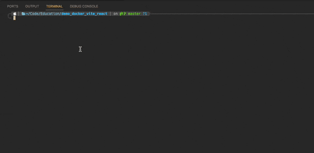

# Demo: Docker / Vite / React for using docker-container for development

This project is a simple web application built using React, packaged in a Docker container using Vite.

The main goal of the project is to run a Vite development server inside a Docker container to provide a consistent development environment.

## Quick start

Clonning project

```bash
git clone someURL demo_docker_vite_react
cd demo_docker_vite_react
```

If you want to run a Vite development server locally, without a Docker container

```bash
# installing packages
yarn install

# run dev server local (not in container)
yarn dev
```

If you want to run a Vite development server inside a Docker container

```bash
# run dev server in container
docker-compose up

# stop dev server
docker-compose down
```


