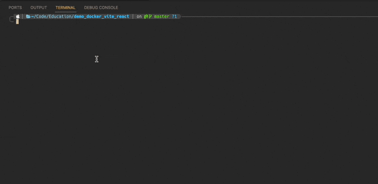
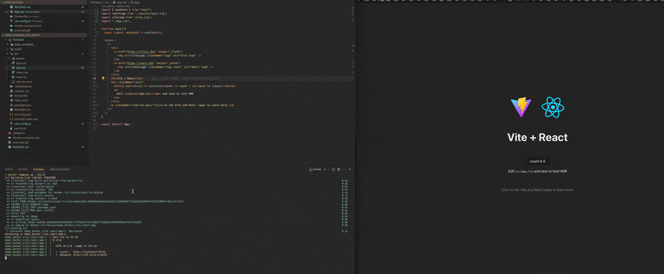

# Demo: Docker / Vite / React for using docker-container for development

This project is a simple web application built using React, packaged in a Docker container using Vite.

The main goal of the project is to run a Vite development server inside a Docker container to provide a consistent development environment.

## Quick start

Clonning project

```bash
git clone someURL demo_docker_vite_react
cd demo_docker_vite_react
```

If you want to run a Vite development server locally, without a Docker container

```bash
# installing packages
yarn install

# run dev server local (not in container)
yarn dev
```

If you want to run a Vite development server inside a Docker container

```bash
# run dev server in container
docker-compose up

# stop dev server
docker-compose down
```

How it should work.



## Configuration for using Vite with Docker

We need to configure developer server in `vite.config.ts` for use static port and another staff.

```js
import { defineConfig } from "vite";
import react from "@vitejs/plugin-react";

export default defineConfig({
  plugins: [react()],
  // develop server configuration
  server: {
    // for hot reloading
    watch: { usePolling: true },
    host: true,
    strictPort: true,
    port: 5173,
  },
});
```

##

After that we need to ignore node_modules in our project. To do this, we add `.dockerignore`. Since we can develop on different platforms (e.g. MacOS or Linux), different dependencies are installed when installing packages (`yarn install`).

```
node_modules
```

So, to make sure that nothing breaks, you should not use the current node_modules folder in both places.
Therefore, we will install it separately for the container.

`Dockerfile`:

```
FROM node:lts-alpine

WORKDIR /app
COPY package.json .
RUN yarn install
COPY . .

## EXPOSE [Port you mentioned in the vite.config file]
EXPOSE 5173

CMD ["yarn", "dev"]
```

`Dockercompose.yml`:

```
version: '3'
services:
  app:
    build:
      context: ./frontend
      dockerfile: Dockerfile
    ports:
      - 80:5173
    volumes:
      - ./frontend:/app
      - /app/node_modules
```

- `/app/node_modules` — let us to not sinhronize the local and container node_modules

## Run with development server on container

After as we will all set up and start our container open http://localhost (with 80 port by default)


